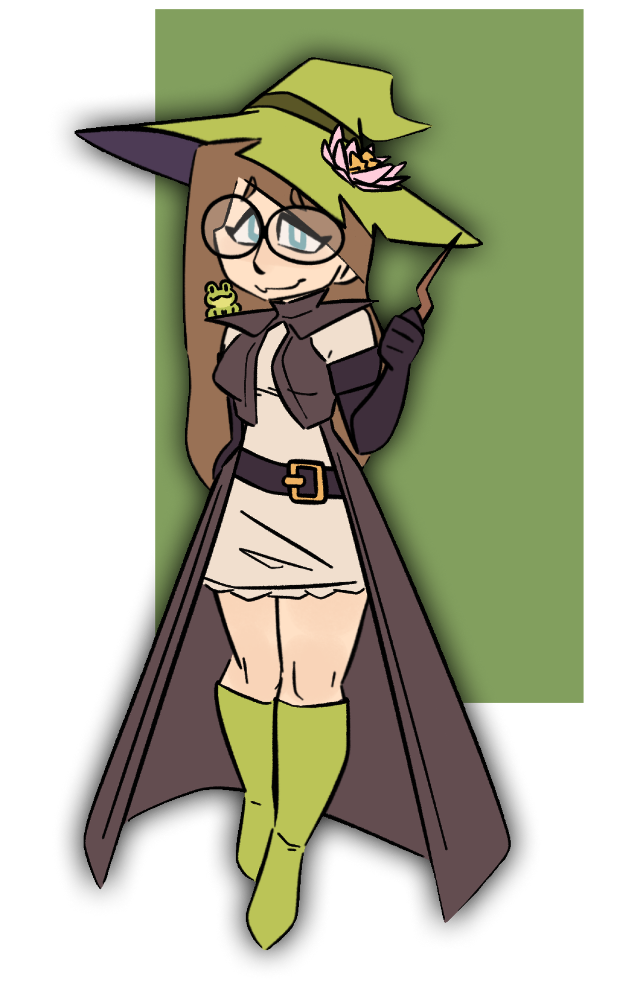

    
    

    <picture>><picture>

 
<picture></picture>

<h2>/* ABOUT */</h2>  
<ul>
    <li>⭐ My realm is Web dev, Games, and QA.</li>
    <li>🕵️‍♀️ Mainly working in private repos.</li>
    <li>💚 CRT TVs, Data Archiving, and PC Building.</li>
    <li>⛰️ When I'm not on my PC, I'm in a Cave or on a Mountain.</li>
</ul>

  
<h2>/* SKILLS */</h2>
<ul>
    <li>
        <h3>Languages</h3>
        <picture></picture>
        <picture></picture>
        <picture></picture>
        <picture></picture>
        <picture></picture>
        <picture></picture>
        <picture></picture>
        <picture></picture>
        <picture></picture>
        <picture></picture>
        <picture></picture>
    </li>
    <li>
        <h3>Technologies</h3>
        <picture></picture>
        <picture></picture>
        <picture></picture>
        <picture></picture>
        <picture></picture>
        <picture></picture>
        <picture></picture>
    </li>
    <li>
        <h3>Other Technologies</h3>
        <picture></picture>
        <picture></picture>
    </li>
</ul>

 
